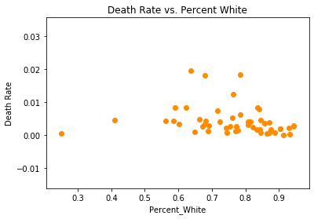
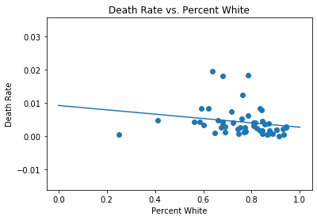
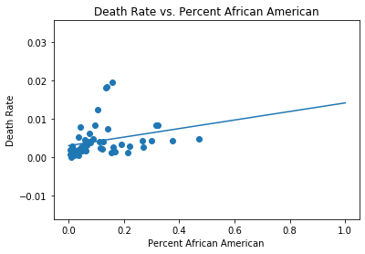
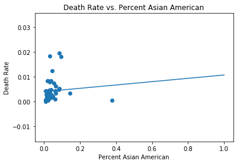
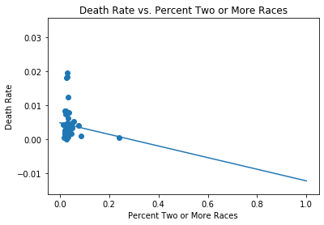

# Homework 1
Math 189Z – COVID-19: Data Analytics and Machine Learning 
Nico Espinosa Dice

## Task 1
Code available in file [Homework1.ipynb](https://github.com/nico-espinosadice/math189-covid19/blob/master/Homework%201/Homework%201.ipynb). 

## Task 2
Code available in file [Homework1.ipynb](https://github.com/nico-espinosadice/math189-covid19/blob/master/Homework%201/Homework%201.ipynb). 

### Research Question:
Is the death rate of US states correlated with their racial demographics?  

### Data: 
I test the relationship between the racial demographics of states and their death rates. I obtained data from World Population Review ([link](https://worldpopulationreview.com/states/states-by-race/)) about the racial demographics of each state. I also used data from The Covid Tracking Project ([link](https://covidtracking.com/data)) which included the number of cases and deaths of each state.

### Methods:
I use linear regression to evaluate correlation between the racial demographics of each state. The code is in the file.

### Results:
  
  
  
  
  
    
### Discussion:
The regression shows a negative slope for the model involing white Americans and people of two or more races, and a negative slope for the model involving African Americans and Asian Americans. This demonstrates support for my hypothesis, since the regression involving African Americans had a positive slope. However, I cannot draw too many conclusions from these results given the low R^2 value of the regression models.

## Task 3
I am taking this course because I believe it is an excellent opportunity to apply knowledge that I learn towards a current problem in society – in this case, a major global crisis. I am hoping to sharpen current skills, as well as learn the theory of new algorithms and gain practice applying them towards current world data.

This homework took me approximately 2 hours.
